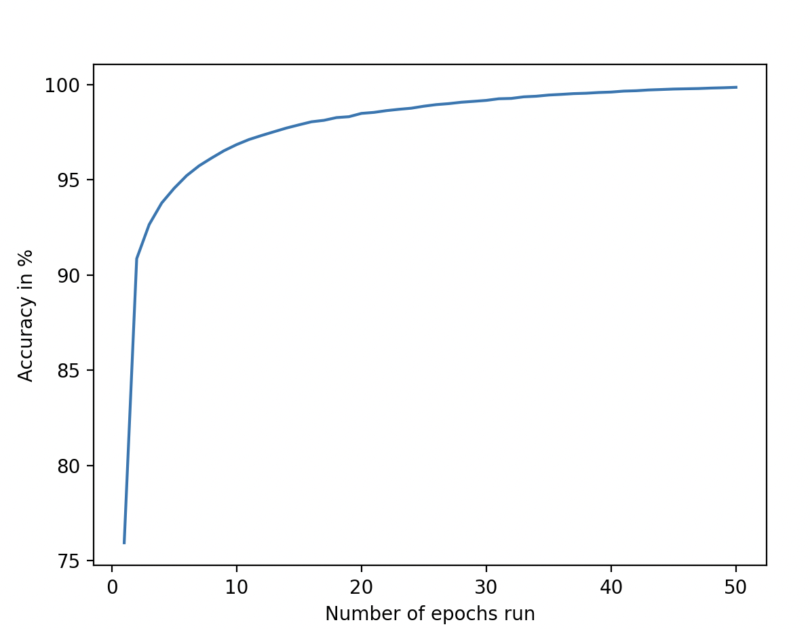
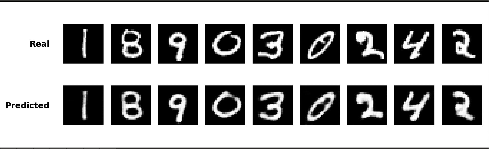

This is a ReadME for the MNIST dataset to use Neural Networks

The Universal workflow for a Neural Network is to:

1) Initialize the Model with code
2) Create a Loss function to measure accuracy
3) Choose an optimizer
4) Write a loop so it trains through the data
5) Test it with the data it has not seen yet

First Run on 50 Epochs!

First Run of the Autoencoder on MNIST dataset
